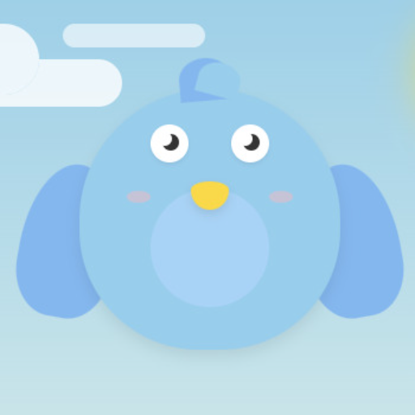

# Focus Buddy

A gamified task tracker with a friendly companion to help you stay productive.

## Overview

Focus Buddy is a web-based productivity application that combines the Pomodoro technique with task tracking and a cute animated companion. The app helps you stay focused, manage your time effectively, and make work sessions more enjoyable.

## Features

- **Pomodoro Timer**: Work in focused intervals with customizable work and break periods
- **Task Management**: Create, track, and complete tasks during your work sessions
- **Gamified Experience**: A friendly bird companion that reacts to your progress
- **Progress Tracking**: Visual representation of your session progress
- **Day/Night Mode**: Automatic or manual toggle between day and night themes
- **Responsive Design**: Works on desktop and mobile devices

## Technologies Used

- HTML5
- CSS3 (with animations and responsive design)
- Vanilla JavaScript
- Local Storage for data persistence

## Live Demo

Visit [https://markorenic.github.io/gsd/](https://markorenic.github.io/gsd/) to see Focus Buddy in action.

## Context

Completed during a vibe coding session to see how good Claude 3.7 Sonnet is.

---

Made with ❤️ for productivity 